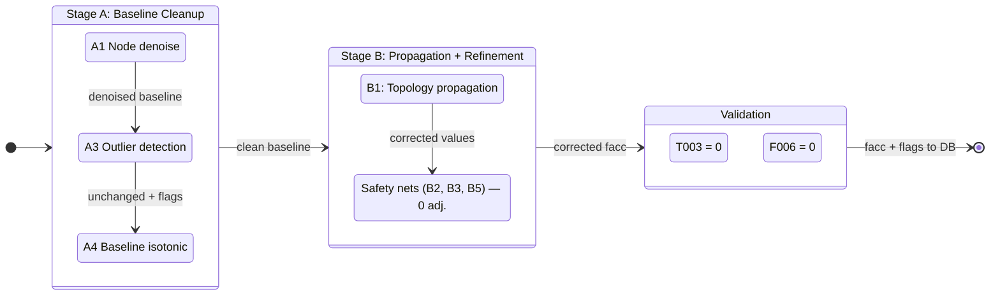
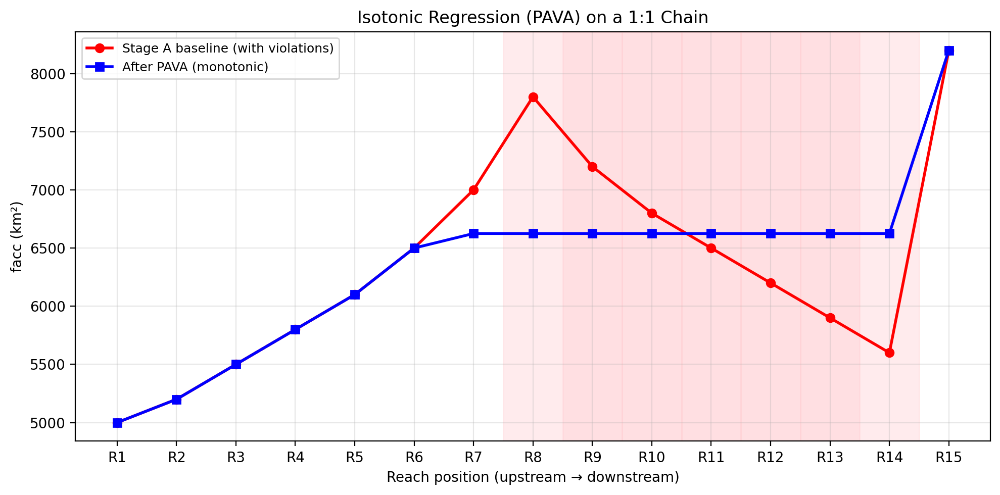
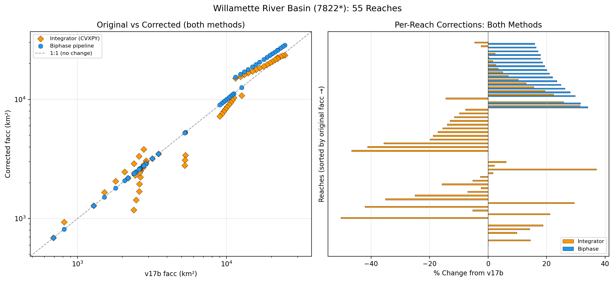
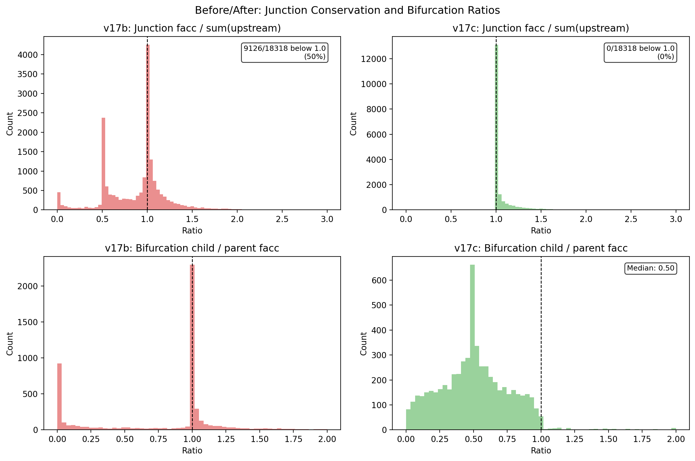
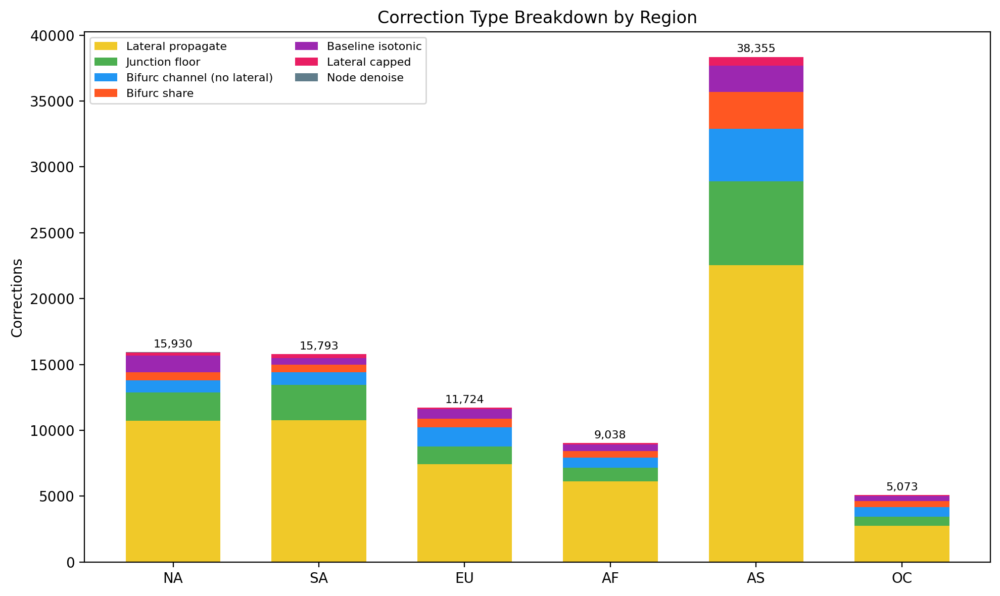
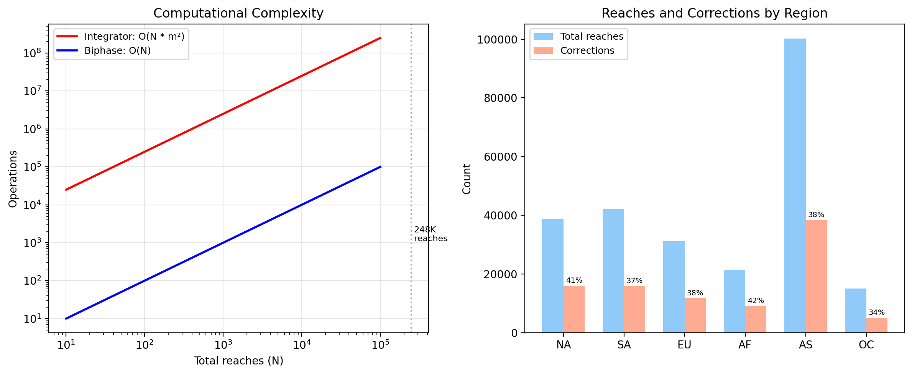

# Flow Accumulation Correction: Technical Report

**SWORD v17c** | February 2026 | Gearon, Pavelsky

---

## 1. Problem: Why v17b Facc Has Errors

SWORD's flow accumulation (`facc`, km^2) is extracted from MERIT Hydro's **UPA (upstream area)** raster. UPA is derived from a **D8 (deterministic eight-neighbor)** flow direction algorithm, which routes all flow from each raster cell to exactly one downhill neighbor. The D8 directions determine the UPA values: each cell's UPA is the total area of all cells that drain through it under D8 routing. This single-flow-direction raster fundamentally conflicts with SWORD's multi-channel vector network topology, producing three systematic error modes in the UPA values that SWORD samples.

### 1.1 Bifurcation Cloning

When a river splits into two or more channels, D8 routes all flow to one neighbor, so UPA has no mechanism to partition drainage area. Every child channel's UPA value reflects the full parent drainage:

```
        Parent (facc = 1,089,000 km^2)
        /                              \
  Child A (facc = 1,089,000)    Child B (facc = 1,089,000)
```

The correct values should be proportional to channel width. If Child A carries 60% of the flow (by width), it should have ~653,000 km^2 and Child B ~436,000 km^2. Instead, both get the full 1,089,000 km^2.

**Scale**: ~2,910 bifurcation points globally across 248,674 reaches.

### 1.2 Junction Inflation

When cloned channels rejoin at a downstream junction, their facc values are naively summed:

```
  Child A (1,089,000) + Child B (1,089,000)  ->  Junction (2,178,000)
```

The junction should have ~1,089,000 km^2 plus any lateral drainage between the bifurcation and junction. This double-counting propagates downstream: every reach below inherits the inflated value. In complex deltas with nested bifurcation-junction pairs, inflation compounds exponentially. The Lena River delta (73 bifurcations, 107 junctions) reached 1.65 billion km^2 under naive correction — 674x the real 2.49M km^2 basin area.

**Scale**: ~18,000 junction deficit violations in v17b.

### 1.3 Raster-Vector Misalignment

SWORD's vector reaches and MERIT's UPA raster cells don't align perfectly. When a reach's node sampling point falls on a neighboring UPA flow path, the sampled facc can be 2-50% lower than the upstream reach's facc — a physical impossibility on a non-bifurcating channel. These are random drops on 1:1 links (single parent, single child), not topology errors.

**Scale**: ~8,000 1:1-link drops globally.

### 1.4 Concrete Example

In the Ganges delta, UPA assigns 1,089,000 km^2 to every distributary child — the full upstream basin area — because D8 cannot split flow. Width-proportional splitting would give the main channel ~650,000 km^2 and secondary channels proportionally less. Without correction, downstream junctions double-count, and the error cascades through hundreds of downstream reaches.

---

## 2. Prior Work: Constrained Optimization (DrainageAreaFix)

A colleague developed a constrained optimization approach using CVXPY. The formulation solves for incremental (local) drainage areas per reach by minimizing weighted least-squares deviation from observed UPA values (`min ||W(Ax - L)||^2`) subject to non-negativity (`x >= 0`) and optional hard anchors at gauged reaches. The solver (OSQP/ECOS) converges quickly on small basins — the Willamette River (55 reaches) solved in <1 second with all incremental areas non-negative.

The approach requires manual basin delineation, junction identification, and constraint setup per basin. Matrix factorization is O(m^2)-O(m^3) per basin, so applying globally to 248K reaches would require processing thousands of basins individually.

---

## 3. Our Approach: Biphase Denoise Pipeline

### 3.0 Same Goal, Different Formulation

Both approaches enforce conservation (downstream facc >= sum of upstream facc) and non-negativity (no negative incremental drainage). We achieve this via a topological-order algorithm that processes the entire global network without manual basin setup. The key architectural choice: **clean baseline noise before propagation** — eliminating MERIT D8 artifacts from the raw data prevents error amplification when corrections cascade through the network.

### 3.1 Lint Checks Referenced

The pipeline targets specific violations detected by our lint framework (`src/sword_duckdb/lint/`):

| Check | What it tests |
|-------|---------------|
| **T003** | Facc monotonicity — downstream facc < 95% of upstream facc on non-bifurcation edges (5% tolerance, excludes reaches with 2+ downstream neighbors) |
| **F006** | Junction conservation — facc < sum(upstream facc) at junctions with 2+ inputs (1 km^2 tolerance) |

### 3.2 Pipeline Architecture Overview

The pipeline has two stages:

- **Stage A** — Baseline Cleanup (clean MERIT noise from raw data, no propagation)
- **Stage B** — Propagation + Refinement (topology-aware correction, consistency enforcement)



### 3.3 Stage A — Baseline Cleanup

Stage A operates on the raw MERIT UPA values **before any topology propagation**. Its purpose is to remove D8 raster noise so that Stage B starts from a clean baseline, preventing error amplification.

#### A1 — Node Denoise

Each reach has ~10-50 nodes spaced ~200m apart, each independently sampling the MERIT Hydro UPA raster. Normally we take `MAX(node facc)` as the reach's baseline facc, since drainage area is highest at the downstream end. But some nodes' sampling points land on an adjacent UPA flow path (a parallel tributary or different branch), returning a facc value that has nothing to do with the reach's actual river. We detect this by comparing `MAX(node facc)` to `MIN(node facc)` within each reach: on a ~2-10 km segment, facc should vary by a few percent at most, so `MAX/MIN > 2.0` indicates at least one node hit a wrong UPA cell. For these noisy reaches, we use the downstream-most node's facc (the most physically meaningful sample, since it sits at the reach's connection point to the next reach) instead of `MAX`. This affects ~7,345 reaches (3.0%) globally and removes the noise source before topology correction.

#### A3 — Outlier Detection (Diagnostics Only)

A3 flags remaining statistical outliers using a neighborhood log-deviation metric: for each reach, compute the log-space deviation between its baseline facc and the median of its neighbors' baseline facc. Flag reaches exceeding the Tukey IQR upper fence (Q3 + 1.5*IQR). **This step does not modify facc values** — it produces diagnostic metadata (`phase3_flagged`) for downstream review.

#### A4 — Baseline Isotonic Regression

**This is the key innovation that eliminates T003 violations.** A4 runs the Pool Adjacent Violators Algorithm (PAVA) on 1:1 chains in the baseline — before any topology propagation. It extracts maximal sequences of reaches where each has exactly one upstream and one downstream neighbor, and smooths any non-monotonic sequences to find the closest non-decreasing fit in log-space.

By cleaning MERIT's D8 noise from the baseline, A4 ensures that when Stage B propagates corrections through the network, it starts from monotonic 1:1 chains. Without A4, residual drops in the baseline would survive propagation and appear as T003 violations in the final output — exactly what happened in the old pipeline (5,804 T003 flags). With A4, the final T003 count is **0**.

A4 adjusts ~12,662 reaches globally (though most get superseded by Stage B propagation — the final `baseline_isotonic` count in the output is 5,407 reaches whose A4 adjustment was the only correction they received).


*Figure 4. PAVA on a synthetic 15-reach 1:1 chain. The red line (Stage A baseline) has a violation zone where facc decreases from R8 to R14. PAVA (blue) merges R7–R14 into a single flat pool at ~6,625 km² — the weighted mean that minimizes total squared distortion while guaranteeing a non-decreasing sequence. R7 is pulled down from 7,000 to join the pool because the backward-merging step detects that the initial pool mean (from R8–R14 alone) would fall below R7, violating monotonicity. The shaded regions mark where facc was decreasing in the original data.*

### 3.4 Stage B — Propagation + Refinement

Stage B takes the clean baseline from Stage A and propagates topology-aware corrections through the network. B1 does all the work; three subsequent safety-net steps (B2, B3, B5) made 0 adjustments globally. (B4 was removed during development — it caused cascading inflation.)

#### B1 — Topology propagation

Process all reaches in topological order (headwaters first, outlets last). This guarantees that every reach's upstream neighbors are already corrected before we visit it. Five cases, each with a closed-form rule:

| Case | Rule | Description |
|------|------|-------------|
| **Headwaters** | `corrected = baseline` | No upstream to correct against |
| **Junctions** (2+ upstream) | `corrected = sum(corrected_upstream) + lateral` | `lateral = max(baseline - sum(baseline_upstream), 0)`. The max-0 clamp catches D8 cloning inflation (negative lateral = physically impossible). Tradeoff: real lateral drainage is zeroed alongside inflation in clone cases. |
| **Bifurcation children** | `corrected = corrected_parent * (width / sum_sibling_widths)` | Width-proportional split instead of D8's full-clone. Equal-split fallback when width data is missing. |
| **1:1 links in bifurcation channels** | `corrected = corrected_parent` (zero lateral) | D8 assigns full parent UPA to every reach in both branches; allowing lateral here would re-inject the pre-split value. Channel membership tracked by pre-pass. |
| **Normal 1:1 links** | `corrected = corrected_parent + lateral` | `lateral = max(baseline - baseline_parent, 0)`, with 10x cap to block D8 re-injection. This propagates bifurcation splits downstream through 1:1 chains. Dominant correction type (60,288 reaches globally). |

**Lateral inflation is structurally prevented.** Because laterals are computed from baselines (`max(baseline - baseline_parent, 0)`), a junction floor raise to the parent does not inflate the lateral term — only genuine baseline drainage increments propagate. The 10x cap (`lateral > 10 * baseline_parent` → zero) blocks D8 re-injection, and bifurcation channel membership (`corrected = corrected_parent`, zero lateral) prevents re-injection of pre-split UPA values. Together these prevent the exponential compounding that produced 1.65 billion km^2 on the Lena delta in our v1 attempt, where junction raises cascaded unchecked through nested bifurcation-junction pairs.

#### Safety nets (B2, B3, B5)

Three additional steps follow B1, all retained as safety nets: **B2** runs PAVA on 1:1 chains in the corrected values with bifurcation children pinned as high-weight anchors; **B3** re-enforces junction conservation after B2; **B5** recomputes all correction rules in a final topological pass (junction floors raise-only, bifurcation shares unconditional, 1:1 lateral raise-only). In the current run, all three are **no-ops** (0 adjustments globally) — B1 already produces a fully monotonic, conservation-consistent result.

### 3.5 Scalability

Topological sort is O(V + E). Isotonic regression is O(k) per chain. Total runtime for all 248,674 reaches across 6 regions: **~24 seconds** on a single machine. No manual basin delineation or constraint setup required.

---

## 4. Comparison

| Dimension | Integrator (CVXPY) | Biphase Pipeline |
|-----------|-------------------|-------------|
| **Formulation** | Constrained QP: min \|\|W(Ax - L)\|\|^2 | Topological-order rules + isotonic regression |
| **Objective** | Minimize weighted deviation from UPA | Conservation + data fidelity (same goal) |
| **Constraints** | x >= 0, optional hard anchors | Junction floor, width-proportional splits |
| **Scale tested** | 55 reaches (1 basin) | 248,674 reaches (6 regions, global) |
| **Runtime** | <1s per basin | ~24 sec global |
| **Manual setup** | Basin delineation, constraint reach IDs | None (auto from topology) |
| **Bifurcation handling** | Implicit in A matrix structure | Explicit width-proportional split |
| **Monotonicity** | Not enforced (same as F006 only) | Enforced via baseline isotonic (T003 = 0) |
| **Outlier handling** | Tukey IQR + re-solve with downweighting | Tukey IQR + baseline cleanup |
| **Output** | Incremental areas (x) -> total facc | Corrected total facc directly |
| **Dependencies** | CVXPY, OSQP/ECOS solvers | NetworkX, NumPy |

### Mathematical Equivalence

Both approaches minimize deviation from observed UPA values subject to non-negativity and conservation. The integrator achieves this via dense matrix factorization on incremental areas; we achieve it via graph traversal with closed-form rules at each node type.

Our junction rule `corrected = sum(corrected_upstream) + max(base - sum(base_upstream), 0)` is equivalent to enforcing `incremental_area >= 0` at each junction — the `max(..., 0)` clamps the lateral term to non-negative, identical to the integrator's `x >= 0` constraint. At the single-basin level with uniform weights, the solutions are equivalent. The key difference is scalability: our formulation processes the entire global network in one pass without requiring basin-by-basin decomposition.

### Willamette Basin Case Study (Basin 7822)

To compare both approaches on the same basin, we applied the biphase pipeline and the CVXPY integrator to the Willamette River: 55 reaches (52 dependent, 3 independent headwaters). The integrator uses two hard anchors (reaches 78220000031 and 78220000401) and iterative Tukey outlier downweighting.


*Figure 5. Left: log-log scatter of v17b facc (x) vs corrected facc (y) for both methods. Orange diamonds = integrator (CVXPY), blue circles = biphase pipeline, dashed line = no change. Right: paired per-reach % change bars sorted by original facc (ascending), showing how each method adjusts the same reaches.*

**Key results:**

| Metric | Biphase Pipeline | Integrator (CVXPY) |
|--------|------------------|--------------------|
| Reaches modified | 17 / 55 | 49 / 55 |
| % change range | 0% to +34% | -50% to +37% |
| Direction | Raises only | Raises and lowers |
| Correction types | Lateral propagation (16), junction floor (1) | QP redistribution (all) |

The two methods produce highly correlated results (r = 0.996) but differ in philosophy. The integrator redistributes incremental area across all 52 dependent reaches via QP minimization, lowering some reaches to raise others. The biphase pipeline only modifies reaches that violate specific rules (conservation, monotonicity, bifurcation cloning) and leaves the remaining 38 reaches at their v17b values. Both enforce non-negative incremental area and junction conservation.

---

## 5. Global Results


*Figure 1. Before/after evidence that v17c corrections fix real errors. Top row: junction conservation (facc / sum of upstream facc) — v17b has ~51% of junctions violating conservation (ratio < 1.0); v17c has effectively 0 violations. Bottom row: bifurcation child/parent ratio — v17b shows a UPA cloning peak at ratio ~1.0 (every child gets full parent facc); v17c shifts the median to ~0.47 (width-proportional splitting).*

Data from summary JSONs (all regions applied):

| Region | Reaches | Corrections | Raised | Lowered | Net % Change | T003 | F006 |
|--------|---------|-------------|--------|---------|--------------|------|------|
| NA | 38,696 | 15,930 | 13,177 | 2,753 | +203.7% | 0 | 0 |
| SA | 42,159 | 15,793 | 13,949 | 1,844 | +417.1% | 0 | 0 |
| EU | 31,103 | 11,724 | 9,661 | 2,063 | +107.8% | 0 | 0 |
| AF | 21,441 | 9,038 | 7,710 | 1,328 | +171.3% | 0 | 0 |
| AS | 100,185 | 38,355 | 32,054 | 6,301 | +1,420.9% | 0 | 0 |
| OC | 15,090 | 5,073 | 3,975 | 1,098 | +69.6% | 0 | 0 |
| **Total** | **248,674** | **95,913** | **80,526** | **15,387** | — | **0** | **0** |


*Figure 2. Correction type breakdown by region. Lateral propagation (yellow) dominates, followed by junction floors (green) and baseline isotonic (purple). AS has the most corrections due to its large reach count and complex delta systems.*

Correction type breakdown (global totals from summary JSONs):

| Correction Type | Stage | Count | Description |
|-----------------|-------|-------|-------------|
| lateral_propagate | B1 | 60,288 | Bifurcation-split cascade on 1:1 links |
| junction_floor | B1 | 14,306 | Junction conservation enforcement |
| bifurc_channel_no_lateral | B1 | 8,771 | Zero lateral on 1:1 links inside bifurcation channels |
| bifurc_share | B1 | 5,664 | Width-proportional bifurcation splitting |
| baseline_isotonic | A4 | 5,407 | Baseline PAVA smoothing on 1:1 chains |
| lateral_capped | B1 | 1,395 | 10x lateral cap on 1:1 links (D8 re-injection blocked) |
| node_denoise | A1 | 82 | Within-reach node facc variability correction (82 where A1 was the sole final correction; ~7,345 baselines were initially adjusted by A1 but most were superseded by Stage B propagation) |

**Why are net % changes so large?** The "Net % Change" column reports `(total_facc_after - total_facc_before) / total_facc_before` across all reaches in a region. Large values (e.g., +1,421% for AS) reflect the intended behavior of full lateral propagation: when a bifurcation split lowers one branch, the correction cascades through every downstream 1:1 reach. In Asia's large river systems (Ganges, Mekong, Yangtze deltas), a single bifurcation correction propagates through hundreds of downstream reaches. The net % metric is dominated by a few large rivers and does not indicate that typical reaches changed by thousands of percent.

---

## 6. Validation

### 6.1 External Validation

Yushan Li independently verified mass conservation on the NA region geopackage export. Results on 38,696 reaches:

- **All reaches with correct topology pass mass conservation.** The corrected facc values satisfy `facc >= sum(upstream facc)` at every junction.
- 32 **topology metadata inconsistencies** found: `n_rch_up`/`n_rch_down` mismatches on ghost/lake reaches with stale neighbor counts inherited from v17b. These are not facc correction errors — they are pre-existing topology metadata bugs (the actual topology edges are correct; only the summary count columns were stale).
- 16 **dist_out monotonicity violations** found: reaches where dist_out increases downstream, caused by a v17b bifurcation-handling bug in the dist_out algorithm.

Both issues are separate from facc correction and have been resolved in v17c via neighbor-count reconstruction (`n_rch_up`/`n_rch_down` recomputed from `reach_topology` table) and the dist_out bifurcation fix.

### 6.2 What is Fixed

| Constraint | Status | Count | Enforced by |
|------------|--------|-------|-------------|
| **Junction conservation** (F006): facc >= sum(upstream) at every junction | **Fully enforced** | 0 violations | Stage B (B1 + B5) |
| **Non-negative incremental area**: facc >= sum(upstream) | **Fully enforced** | 0 violations | Stage B (B1 lateral clamp + B5) |
| **1:1 monotonicity** (T003): downstream facc >= 95% of upstream on non-bifurcation edges | **Fully enforced** | 0 violations | Stage A4 baseline isotonic + Stage B propagation |
| **Bifurcation partitioning**: children sum to parent facc | **Enforced** (width-proportional) | ~246 residual (missing width data, <0.1%) | Stage B1 bifurc split |

### 6.3 T003 = 0 Globally

The previous pipeline left 5,804 T003 violations (2.3% of reaches) as residual MERIT UPA noise. The biphase architecture eliminates all of them by cleaning the baseline **before** propagation. Stage A4's isotonic regression smooths 1:1 chain drops in the raw MERIT data, and Stage B's propagation preserves this monotonicity through the network.

This is a structural improvement, not a force-correction hack. The old pipeline ran isotonic regression **after** propagation, so MERIT noise in the baseline survived through the topology pass and reappeared as violations in the output. By cleaning first, we prevent noise from entering the propagation in the first place.

**Note on tolerances:** The T003 lint check uses a 5% tolerance (`facc_down < facc_up * 0.95`) to avoid flagging trivial rounding differences. The pipeline's internal validation uses a stricter 1 km^2 absolute tolerance. Both report 0 violations after correction.

### 6.4 F006 = 0 Globally

Junction conservation is guaranteed: at every junction with 2+ upstream inputs, `corrected_facc >= sum(corrected_upstream_facc)`. This is enforced by Stage B1's junction floor rule and verified by the F006 lint check across all 6 regions.

### 6.5 Diagnostic Flags

After correction, the inline validation (`_phase6_validate`) computes three independent diagnostic metrics on the **corrected** values. **These flags are metadata for downstream users. They do not modify facc values.** (Note: A3's outlier detection runs earlier on the pre-correction baseline and is separate from these post-correction diagnostics.)

1. **Junction raises >2x**: Junctions where the corrected value is more than 2x the v17b baseline — likely over-floored by inflated upstream branches.
2. **1:1 drops**: 1:1 links where the upstream reach's corrected facc exceeds the downstream's by more than 1 km^2 — residual UPA misalignment that survived the pipeline.
3. **Bifurcation-excluded T003**: Bifurcation edges where facc drops downstream (expected behavior, excluded from T003 violation counts).

### 6.6 Full Lint Suite

47 lint checks pass at ERROR severity across all regions. Key facc-related checks:

| Check | Description | Result |
|-------|-------------|--------|
| T003 | Facc monotonicity (non-bifurcation edges) | **0 violations** |
| F006 | Junction conservation (facc >= sum upstream) | **0 violations** |
| T001 | dist_out monotonicity | 0 violations |
| T005 | Neighbor count consistency | 0 violations |

---


*Figure 3. Left: Computational complexity — the integrator scales as O(N*m^2) total operations (red) while the biphase pipeline is O(N) regardless of basin size (blue). Right: Reaches and corrections by region, showing a consistent ~37-40% correction rate across all regions.*

---

## 7. Residual Issues

1. **~246 bifurcation imbalance** — Bifurcations where child width data is missing or zero, causing equal-split fallback to produce children that don't sum precisely to the parent. Affects <0.1% of reaches.

2. **UPA-clone junction over-flooring** — ~226 junctions globally where both upstream branches have identical facc (both sampled the same D8 flow path). Stage B uses `sum(upstream)` which over-floors these junctions. This is intentional: clone-aware flooring would introduce new T003 drops that trigger cascade inflation. The over-flooring contributes minimally to the per-region net change.

---

## Appendix: File Reference

### Pipeline Code

```
src/sword_duckdb/facc_detection/
  correct_facc_denoise.py       # Biphase pipeline (Stage A + Stage B)
  detect.py                     # Standalone QA anomaly detection (not called by the pipeline)
```

### Outputs

```
output/facc_detection/
  facc_denoise_v3_{REGION}.csv          # Per-reach corrections (6 files)
  facc_denoise_v3_summary_{REGION}.json # Summary stats (6 files)
  remaining_t003_{REGION}.geojson       # Residual violations for visual audit
  figures/report_fig{1-5}.png           # Report figures
```

### Figure Generation

```bash
python scripts/visualization/generate_facc_report_figures.py \
    --input-dir output/facc_detection \
    --db data/duckdb/sword_v17c.duckdb \
    --v17b data/duckdb/sword_v17b.duckdb
```
