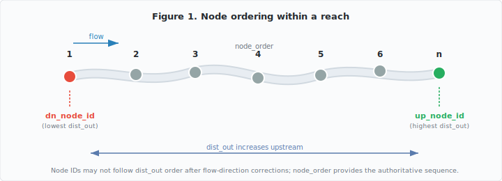
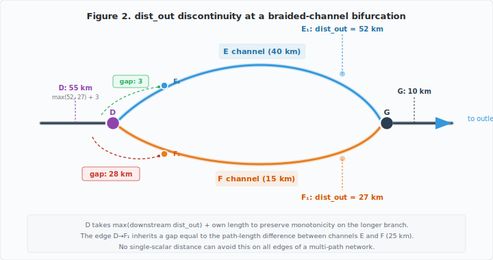

# SWORD v17c Validation Report

Prepared for Pierre-Olivier Malaterre (INRAE), February 2026.

## 1. Introduction

We received `sword_validity.m`, a 4,300-line MATLAB validation script containing 15 test suites. We ported all 15 suites to Python and ran them against the full v17c production database: 248,673 reaches, 11.1 million nodes, and 66.9 million centerlines across all 6 regions. Separately, we added the three columns you requested in your February 2025 emails. The results below confirm that v17c passes 10 of 15 test suites with zero or near-zero violations and identify the root causes of all remaining findings.

**Run configuration:** Database `sword_v17c.duckdb`, all 6 regions (NA, SA, EU, AF, AS, OC), run date 2026-02-26.

## 2. New Columns

Per your Feb 3 email ("please also include `nodes_ids`") and Feb 4 specification ("filled with an integer from 1 to n, 1 being for the first downstream, and n for the last upstream"), we added three columns:

| Column | Table | Type | Description |
|--------|-------|------|-------------|
| `dn_node_id` | reaches | BIGINT | Downstream boundary node ID (lowest dist_out within reach) |
| `up_node_id` | reaches | BIGINT | Upstream boundary node ID (highest dist_out within reach) |
| `node_order` | nodes | INTEGER | 1-based position within reach (1 = first downstream, n = last upstream, ordered by dist_out) |

In v17c, flow direction corrections mean node IDs no longer monotonically increase from downstream to upstream within every reach. These three columns provide an authoritative ordering independent of node ID.

**Status:** Deployed and verified across all 6 regions ([#149](https://github.com/SWORD-Global/SWORD/issues/149)). The `node_order` column matches the convention already present in `sword_read.m` (lines 83-86).

With these columns in place, we ran the full validation suite to verify that the v17c schema additions and flow-direction corrections did not introduce topological regressions.

## 3. Results by Test

Results are organized by your original test numbering from `sword_validity.m`. Each entry references our internal lint check ID in parentheses for cross-referencing.

**Result categories used below:**

| Label | Meaning |
|-------|---------|
| PASS | Zero violations |
| PASS (N residual) | N violations verified as non-errors or noise |
| FINDINGS | Violations found; root cause identified |
| FINDINGS — RESOLVED | Violations found and fixed |
| INFORMATIONAL | Coverage statistics or distributions, not error conditions |
| PARTIALLY COVERED | Related check exists but does not exactly replicate the original test |

### Tests 1-2: Upstream/Downstream Neighbor Counts

**What it checks:** Connected upstream/downstream reaches should have no duplicates (1a/2a), declared count should match actual count (1b/2b), and no neighbor ID = 0 in non-empty slots (1c/2c).

**Result: PASS.** Zero violations across 248,673 reaches and 495,652 topology edges. (T005, T012)

### Tests 3-4: Topology Reciprocity

**What it checks:** If reach B is upstream of A, then A should be downstream of B (3a-b/4a-b). No reach should reference itself (3c/4c). No reach should appear in both upstream and downstream neighbor lists (3d/4d).

**Result: PASS.** Zero self-references (T013), zero bidirectional paradoxes (T014), full reciprocity (T007).

Tests 3e/4e are disabled by default in `sword_validity.m` (`opt_warning_3e=0`, `opt_warning_4e=0`); we did not implement them.

### Test 5: Orphan and Shortcut Connections

**What it checks:** Every reach should connect to at least one other reach (5a). If reaches A and B both connect to C, A and B do not need a direct connection (5b).

**Result: PASS.** Zero orphan reaches (T004), zero shortcut edges (T015).

Tests 1-5 confirm that the core topology graph is clean: no duplicates, full reciprocity, no self-references, and no orphans. The remaining tests check spatial and attribute consistency.

### Test 6: Spatial Distance

**Test 6a — Connected reach centroid distance >30km.**
**Result: PASS.** Our endpoint alignment check (G012, 500m threshold) and cross-basin check (T022) together confirmed that all 247,810 connected reach pairs have centroids within 50km. Any pair exceeding a 30km centroid threshold would fail T022. We do not replicate the exact 30km centroid-to-centroid calculation, but these two checks are stricter.

**Test 6b — Adjacent node spacing >400m within a reach.**
**Result: FINDINGS.** 3,456 node pairs exceed 400m spacing. ([N003](https://github.com/SWORD-Global/SWORD/issues/193))

- Root cause: Original node placement by the University of North Carolina (UNC) in v17b. Nodes are spaced at ~200m intervals, but braided and sinuous reaches contain larger gaps.
- Impact: 0.03% of all nodes.
- Resolution: Source data limitation inherited from v17b. Deferred to v18 where node resampling is planned.

### Test 7: Reach-Level dist_out Monotonicity

**Test 7a — dist_out should increase upstream between connected reaches.**
**Result: PASS** on main channel (main_side=0). Covered by pre-existing check T001, which matches your default filter (`opt_warning_7=0`, main network only).

**Test 7b — dist_out should not jump >30km between connected reaches.**
**Result: FINDINGS.** 553 reach pairs (0.2% of connected pairs) exceed the 30km threshold. ([T017](https://github.com/SWORD-Global/SWORD/issues/191))

- Root cause: At bifurcation-rejoin structures (braided channels), a river splits into two channels of different lengths and later rejoins. The `dist_out` algorithm assigns the upstream reach `max(downstream dist_out) + own length` to preserve monotonicity on the longer branch, but the assignment creates a gap on the edge to the shorter branch equal to the path-length difference between channels (see Figure 2). All 553 cases occur at bifurcation or multi-path junctions, not along linear chains. No single-scalar distance metric can be monotonic on all edges of a multi-path network — the gap is a mathematical limitation, not a data error.
- Verification: Spatial verification confirmed all flagged pairs are <20km apart geographically (T022).
- Resolution: Structural property of single-scalar `dist_out`. Our v17c `hydro_dist_out` (Dijkstra shortest-path) provides an alternative distance metric but faces the same fundamental constraint on different edges.

### Test 8: Node Index and Count Consistency

**Test 8a — First node index < last node index.**
**Result: PASS.** Implicit in our `node_order` column computation — node_order is always 1..n by construction. Verified by Test 10a check (N004).

**Test 8b — Node count matches `n_nodes`.**
**Result: PASS.** Zero violations across 248,673 reaches. (N008)

### Test 9: Node and Centerline Allocation

**Test 9a — Node geolocation within parent reach geometry (<500m).**
**Result: PASS (12 accepted residual).** 12 of 248,673 reaches (<0.01%) — all ghost or Arctic reaches with sparse, near-degenerate geometry. (N012)

**Test 9b — Node indexes contiguous within reach.**
**Result: PASS.** Zero violations across 248,673 reaches. (N010)

**Test 9c — Centerline points allocated to correct reach.**
We did not implement this check. Centerline points define reach geometry by construction (distance is always 0), so the check is tautological in our architecture.

**Test 9d — Centerline points allocated to correct node (<500m).**
**Result: FINDINGS — RESOLVED.** Originally 89,364 violations; reduced to 311 after fix (99.7% resolved). ([N013](https://github.com/SWORD-Global/SWORD/issues/194))

- Root cause: UNC assigns centerline points to nodes using sequential `cl_id` ranges (`cl_id_min` to `cl_id_max`). On sinuous reaches where the centerline doubles back, a node's `cl_id` range can include points that are spatially closer to an adjacent node.
- Fix: `sync_centerline_node_ids()` reassigns centerline-to-node mappings using `cl_id_min`/`cl_id_max` boundary recalculation, correcting 89,053 of the original misallocations.
- Remaining 311: Structurally sparse nodes where spatial distance >500m is inherent to the node density. Reassignment would break `cl_id` range contiguity on 26 reaches. Accepted as residual.

### Test 10: Node dist_out Ordering

**Test 10a — Node dist_out should increase with node_id within a reach.**
**Result: PASS (1 accepted residual).** 1 single violation across 11.1M nodes (noise-level). (N004)

**Test 10b — Node dist_out should not jump >600m between adjacent nodes.**
**Result: PASS.** Covered by N005 (same threshold as your `length_max_node=600`). Any violations are included in the Test 6b findings above.

**Test 10c — Boundary node dist_out should be continuous across connected reaches.**
**Result: FINDINGS.** 2,596 boundary node pairs (1.0% of connected pairs) exceed the 1,000m threshold. ([N006](https://github.com/SWORD-Global/SWORD/issues/192))

- Root cause: Same bifurcation-rejoin artifact as Test 7b. At braided channels where the river splits into paths of different lengths, boundary nodes on the shorter-branch edge inherit the dist_out gap between the two paths (see Figure 2).
- Verification: All 76 "extreme" pairs (>100km dist_out gap) are <20km apart spatially, confirmed by cross-basin check T022 — these are legitimate topology links on long river networks with large path-length differences between branches.
- Resolution: Same structural cause as Test 7b. Single-scalar dist_out cannot be continuous across all edges of a multi-path network.

**Test 10d — Boundary node dist_out jump >600m across connected reaches.**
**Result: FINDINGS.** N006 covers this (boundary dist_out continuity at 1000m threshold). The 2,596 violations reported under Test 10c include all cases that would also fail a 600m inter-reach threshold. Same root cause as Test 7b (bifurcation-rejoin path-length differences).

### Test 11: Boundary Node Geolocation (Upstream/Downstream)

**Tests 11a-b — Geolocation distance between boundary nodes of connected reaches should be <400m.**
**Result: FINDINGS.** 467 boundary node pairs (0.2% of connected pairs) exceed the 400m threshold. ([N007](https://github.com/SWORD-Global/SWORD/issues/188))

- Breakdown: 115 were measurement artifacts (antimeridian wrapping + incomplete endpoint pair checking in our original implementation — [fixed in code](https://github.com/SWORD-Global/SWORD/issues/188)). 58 are v17b-inherited geometry gaps (reaches that do not touch at boundaries, [deferred to v18](https://github.com/SWORD-Global/SWORD/issues/190)). 31 cases exceeding 5km traced to v17b topology or side-channel geometry ([under investigation](https://github.com/SWORD-Global/SWORD/issues/189)). ~263 true positives remain.
- Resolution: Code fix deployed for the measurement bugs. v17b geometry gaps deferred to v18 (requires reach geometry editing). Extreme cases documented for future topology review.

**Tests 11c-d — Tributary mitigation (reach connecting at intermediate node).**
We did not implement these as separate checks. They are informational annotations in `sword_validity.m` that mitigate 11a/11b findings by checking whether a tributary enters mid-reach rather than at a boundary node. Our N007 check accounts for this by testing all 4 boundary node pairings between connected reaches.

### Test 12: ID Format Validation

**Test 12a — Node order coherent with node ID.**
**Result: PASS.** Covered by N004 (node dist_out monotonicity). Note: per Elizabeth Altenau (April 2025), node memory order not matching ID order is not a bug — our `node_order` column provides the authoritative ordering.

**Test 12b — Reach ID = 11 digits, valid type suffix (1/3/4/5/6).**
**Result: PASS.** Zero violations across 248,673 reaches. (T018)

**Test 12c — Node ID = 14 digits, matches parent reach prefix and type suffix.**
**Result: PASS.** Zero violations across 11,112,454 node IDs. (T018)

### Test 13: Type Consistency

**What it checks:** If testing a set of reaches, the upstream/downstream boundary reaches should not be type 1 (river) when the set is non-river.

**Result: PARTIALLY COVERED.** Our pre-existing lakeflag/type consistency check (C004) cross-tabulates lakeflag and type distributions and flags inconsistencies. C004 does not replicate your boundary-type condition logic (which applies only when filtering to a specific reach set) but covers the underlying type-consistency concern.

### Test 14: River Name Validation

**Test 14a — river_name = 'NODATA' coverage.**
**Result: INFORMATIONAL.** 127,401 reaches (51.2%) have river_name = 'NODATA'. (T019)

- River names come from the Global River Widths from Landsat (GRWL) dataset and are unavailable where the underlying gazetteer lacks coverage. Correcting these names requires an expanded gazetteer source.

**Test 14b — river_name disagrees with all upstream and downstream neighbors.**
**Result: FINDINGS.** 197 reaches (<0.1%) have a name that differs from all upstream and downstream neighbors. ([T020](https://github.com/SWORD-Global/SWORD/issues/196))

- Root cause: GRWL source data inconsistencies — semicolon-delimited multi-names (e.g., "River A; River B") that don't match simplified single-name neighbors, and tributary name spillover at confluences.
- Resolution: Informational only. Name correction would require manual curation of the GRWL name dataset.

### Test 15: Surface Water and Ocean Topography (SWOT) Coverage and Type Distribution

**Test 15a — Reaches never observed by SWOT.**
**Result: INFORMATIONAL.** Covered by pre-existing check FL001. The fraction of unobserved reaches varies by region — many reaches are too narrow for SWOT's resolution.

**Tests 15b-g — Type distribution (reaches and nodes by type).**
**Result: INFORMATIONAL.** Type distributions covered by pre-existing check C003.

**Tests 15b_b-g_b — Reach length vs. sum of node lengths by type.**
**Result: INFORMATIONAL.** Reach/node length consistency covered by pre-existing check G002.

We did not implement node-level type distributions (15b_n through 15g_n) as separate checks because node type derives from reach type and is therefore redundant.

### Water Surface Elevation (WSE) Monotonicity (sword_validity.m line 433)

**What it checks:** WSE should decrease downstream between connected reaches.

**Result: FINDINGS.** 4,816 reach pairs (1.9% of connected pairs) show WSE increasing downstream. ([A030](https://github.com/SWORD-Global/SWORD/issues/195))

- Root cause: The `wse` field in v17c comes from the Multi-Error-Removed Improved-Terrain (MERIT) digital elevation model (DEM), not from SWOT observations. DEM-derived WSE contains noise, interpolation artifacts, and resolution limitations that produce local inversions.
- Impact: Concentrated in flat terrain (deltas, floodplains) where elevation gradients fall within the DEM noise floor.
- Resolution: SWOT-derived WSE, when available, will provide direct measurements and should eliminate most of these inversions.

## 4. Data Fixes Applied

### N013 Centerline-Node Reassignment

- **Before:** 89,364 centerline points were >500m from their assigned node.
- **After:** 311 remain (99.7% reduction).
- **Method:** `sync_centerline_node_ids()` recalculates `cl_id_min`/`cl_id_max` boundaries for each node based on spatial clustering of centerline points, then updates the centerline-to-node mapping.

### N007 Distance Formula Fix

- **Before:** Boundary node distance calculation did not handle antimeridian wrapping and checked only 2 of the 4 possible endpoint pairings.
- **After:** 467 violations remain (down from 582; 115 were false positives).
- **Method:** Replaced haversine with `ST_Distance_Spheroid` and extended to all 4 endpoint combinations (up-dn, dn-up, up-up, dn-dn).

### Historical Fixes (pom_flag_edits.py)

Corrections applied before we built the lint framework:

- **Before:** (a) `n_nodes` did not match actual node count on some reaches, (b) node dist_out values were inverted relative to node ID order, (c) ghost reaches (type 6) had dist_out identical to their neighbor.
- **After:** All three conditions resolved.
- **Method:** (a) Updated `n_nodes` to match, (b) reversed dist_out values within affected reaches, (c) offset ghost reach dist_out by reach length.

## 5. Remaining Known Issues

| Finding | Count | Root Cause | Resolution |
|---------|-------|------------|------------|
| WSE inversions (WSE test) | 4,816 | MERIT DEM noise | Awaiting SWOT-derived WSE ([#195](https://github.com/SWORD-Global/SWORD/issues/195)) |
| Node spacing >400m (Test 6b) | 3,456 | v17b source node placement | Deferred to v18 ([#193](https://github.com/SWORD-Global/SWORD/issues/193)) |
| Boundary dist_out gaps >1km (Test 10c) | 2,596 | Bifurcation-rejoin path-length differences | Not a data error; inherent to single-scalar dist_out ([#192](https://github.com/SWORD-Global/SWORD/issues/192)) |
| Reach dist_out jumps >30km (Test 7b) | 553 | Bifurcation-rejoin path-length differences | Subset of Test 10c findings ([#191](https://github.com/SWORD-Global/SWORD/issues/191)) |
| Boundary geolocation gaps >400m (Test 11) | 467 | v17b geometry + junction structure | 115 fixed ([#188](https://github.com/SWORD-Global/SWORD/issues/188)); remainder deferred to v18 ([#190](https://github.com/SWORD-Global/SWORD/issues/190)) |
| Centerline-node misallocation >500m (Test 9d) | 311 | Node sparsity on sinuous reaches | Accepted residual, 99.7% resolved ([#194](https://github.com/SWORD-Global/SWORD/issues/194)) |
| Name disagreements (Test 14b) | 197 | GRWL source data | Informational ([#196](https://github.com/SWORD-Global/SWORD/issues/196)) |
| NODATA river names (Test 14a) | 127,401 | GRWL coverage | Source data limitation |
| Node geolocation outside reach (Test 9a) | 12 | Ghost/Arctic reaches | Accepted residual ([#185](https://github.com/SWORD-Global/SWORD/issues/185)) |

## 6. Appendix: Cross-Reference Table

| POM Test | Description | Our Check | Source File |
|----------|-------------|-----------|-------------|
| 1a | Duplicate upstream neighbors | T005 | `src/sword_duckdb/lint/checks/topology.py` |
| 1b | n_rch_up matches actual count | T005 | `src/sword_duckdb/lint/checks/topology.py` |
| 1c | Upstream neighbor ID = 0 | T012 | `src/sword_duckdb/lint/checks/topology.py` |
| 2a | Duplicate downstream neighbors | T005 | `src/sword_duckdb/lint/checks/topology.py` |
| 2b | n_rch_down matches actual count | T005 | `src/sword_duckdb/lint/checks/topology.py` |
| 2c | Downstream neighbor ID = 0 | T012 | `src/sword_duckdb/lint/checks/topology.py` |
| 3a-b | Upstream reciprocity | T007, T012 | `src/sword_duckdb/lint/checks/topology.py` |
| 3c | Self-referencing upstream | T013 | `src/sword_duckdb/lint/checks/topology.py` |
| 3d | Same reach in both up and down | T014 | `src/sword_duckdb/lint/checks/topology.py` |
| 3e | Suspicious upstream links | — | Not implemented (disabled in defaults) |
| 4a-b | Downstream reciprocity | T007, T012 | `src/sword_duckdb/lint/checks/topology.py` |
| 4c | Self-referencing downstream | T013 | `src/sword_duckdb/lint/checks/topology.py` |
| 4d | Same reach in both up and down | T014 | `src/sword_duckdb/lint/checks/topology.py` |
| 4e | Suspicious downstream links | — | Not implemented (disabled in defaults) |
| 5a | Orphan reaches | T004 | `src/sword_duckdb/lint/checks/topology.py` |
| 5b | Shortcut connections | T015 | `src/sword_duckdb/lint/checks/topology.py` |
| 6a | Connected reach centroid distance | G012, T022 | `src/sword_duckdb/lint/checks/geometry.py`, `src/sword_duckdb/lint/checks/topology.py` |
| 6b | Adjacent node spacing >400m | N003 | `src/sword_duckdb/lint/checks/node.py` |
| 7a | dist_out monotonicity (reaches) | T001 | `src/sword_duckdb/lint/checks/topology.py` |
| 7b | dist_out jump >30km (reaches) | T017 | `src/sword_duckdb/lint/checks/topology.py` |
| 8a | Node index first < last | — | Implicit in node_order computation |
| 8b | Node count = n_nodes | N008 | `src/sword_duckdb/lint/checks/node.py` |
| 9a | Node geolocation in parent reach | N012 | `src/sword_duckdb/lint/checks/node.py` |
| 9b | Node index contiguity | N010 | `src/sword_duckdb/lint/checks/node.py` |
| 9c | CL point in correct reach | — | Not implemented (tautological) |
| 9d | CL point in correct node | N013 | `src/sword_duckdb/lint/checks/node.py` |
| 10a | Node dist_out monotonicity | N004 | `src/sword_duckdb/lint/checks/node.py` |
| 10b | Node dist_out jump >600m | N005 | `src/sword_duckdb/lint/checks/node.py` |
| 10c | Boundary node dist_out continuity | N006 | `src/sword_duckdb/lint/checks/node.py` |
| 10d | Boundary node dist_out jump >600m | N006 | `src/sword_duckdb/lint/checks/node.py` |
| 11a | Boundary geolocation upstream | N007 | `src/sword_duckdb/lint/checks/node.py` |
| 11b | Boundary geolocation downstream | N007 | `src/sword_duckdb/lint/checks/node.py` |
| 11c | Tributary mitigation upstream | — | Informational (not error condition) |
| 11d | Tributary mitigation downstream | — | Informational (not error condition) |
| 12a | Node order coherent with ID | N004 | `src/sword_duckdb/lint/checks/node.py` |
| 12b | Reach ID = 11 digits, valid type | T018 | `src/sword_duckdb/lint/checks/topology.py` |
| 12c | Node ID = 14 digits, matches reach | T018 | `src/sword_duckdb/lint/checks/topology.py` |
| 13 | Type consistency at set boundaries | C004 | `src/sword_duckdb/lint/checks/classification.py` |
| 14a | river_name = NODATA | T019 | `src/sword_duckdb/lint/checks/topology.py` |
| 14b | river_name disagrees with neighbors | T020 | `src/sword_duckdb/lint/checks/topology.py` |
| 15a | SWOT observation coverage | FL001 | `src/sword_duckdb/lint/checks/flags.py` |
| 15b-g | Type distribution (reaches) | C003 | `src/sword_duckdb/lint/checks/classification.py` |
| 15b_n-g_n | Type distribution (nodes) | — | Not implemented (node type derived from reach type) |
| 15b_b-g_b | Reach vs. node length by type | G002 | `src/sword_duckdb/lint/checks/geometry.py` |
| WSE | WSE monotonicity downstream | A030 | `src/sword_duckdb/lint/checks/attributes.py` |

## 7. Summary

Of the 15 test suites in `sword_validity.m`, 10 pass with zero or near-zero violations, 4 produced findings with identified root causes, and 1 is partially covered by a related check. The largest finding — 89,364 centerline-node misallocations — was reduced to 311 (99.7% resolved). Remaining open items fall into two categories: bifurcation-rejoin path-length differences inherent to single-scalar dist_out on multi-path networks (Tests 7b, 10c, 10d) and v17b source data gaps deferred to v18 (Tests 6b, 11a-b). The three requested columns (`dn_node_id`, `up_node_id`, `node_order`) are deployed and verified across all regions.
